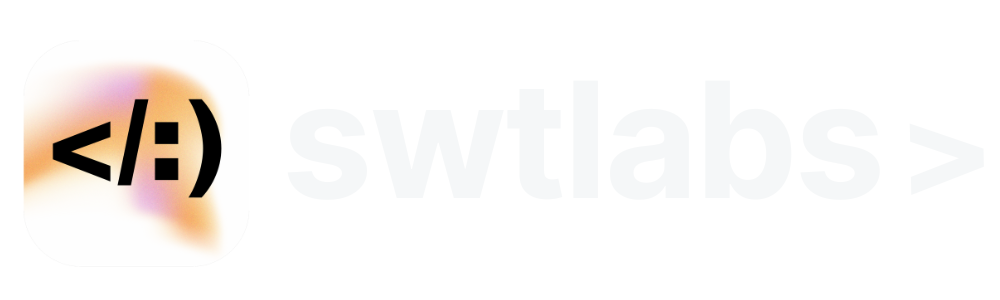

# Impact Market Platform

Polska platforma crowdfundingowa łącząca technologię z działaniami charytatywnymi. Innowacyjne rozwiązanie pozwalające na wspieranie organizacji non-profit poprzez zakup wirtualnych dóbr.

## ✨ Funkcjonalności

- **System wsparcia twórców**:
  - Profile twórców z możliwością bezpośrednich wpłat
  - Śledzenie historii transakcji
  - System subskrybcji cyklicznych

- **Bezpieczne płatności**:
  - Integracja z bramkami płatniczymi
  - Obsługa BLIK, kart płatniczych i przelewów tradycyjnych
  - Automatyczne generowanie potwierdzeń

- **Panel administracyjny**:
  - Zarządzanie profilem twórcy
  - Analiza statystyk wsparcia
  - Narzędzia do komunikacji z darczyńcami

- **Strona informacyjna**:
  - Dynamiczny pasek postępu prac
  - System newslettera
  - Dokumentacja prawna (regulamin, polityka prywatności)

## 🛠 Technologie

**Frontend**:
- React 18 + TypeScript
- Tailwind CSS + PostCSS
- React Router 6
- React Hot Toast
- Lucide React Icons
- **Ikony**: [Flaticon](https://www.flaticon.com/) (wybrane elementy graficzne)

**Backend**:
- Supabase (Auth + Database)
- PostgreSQL
- Crypto-JS

## 📝 Dokumentacja prawna

- [Polityka prywatności](/privacy)
- [Regulamin serwisu](/terms)
- [O projekcie](/about)

## 📬 Kontakt dla twórców

**Stowarzyszenie "Słowem w Twarz"**  
biuro@slowemwtwarz.pl  
+48 575 97 01 31

---

Developed with ❤️ by [SWTLabs](https://swtlabs.pl)  

    Icons by [Author Name] from <a href="https://www.flaticon.com/" title="Flaticon">www.flaticon.com</a>

